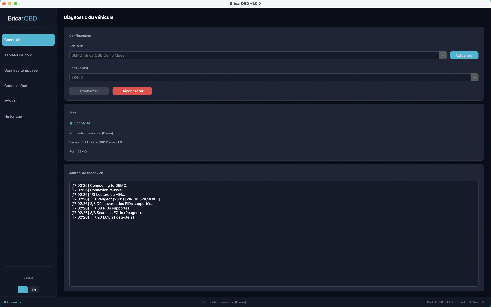

# BricarOBD

**Professional OBD-II diagnostic tool** — Connect to any vehicle via an ELM327 adapter and access all real-time diagnostic data.



## Features

- **Automatic vehicle detection** — Reads VIN, identifies make (39 manufacturers) and loads the matching ECU profile
- **Real-time dashboard** — RPM, speed, temperature, engine load gauges + 6 data cards with alert thresholds
- **PID monitoring** — 70 OBD-II parameters with min/max tracking and progress bars
- **Fault codes (DTC)** — Read, save, export to JSON and clear with double confirmation + automatic backup
- **Extended ECU scan** — 7 standard addresses + manufacturer-specific (up to 20 ECUs for PSA)
- **Anomaly detection** — Automatic alerts for overheating, low battery, critical RPM
- **Bilingual FR/EN** — Full French and English interface
- **Demo mode** — Test the app without an adapter using simulated data
- **Cross-platform** — macOS, Windows and Linux

## Supported manufacturers

| Group | Brands |
|-------|--------|
| **PSA/Stellantis** | Peugeot, Citroën, DS, Opel |
| **VAG** | Volkswagen, Audi, Seat, Škoda, Porsche |
| **German** | BMW, Mini, Mercedes-Benz |
| **American** | Ford, Lincoln |
| **Japanese** | Toyota, Lexus, Honda, Acura, Mazda, Subaru, Nissan, Infiniti |
| **Korean** | Hyundai, Kia, Genesis |
| **Italian** | Fiat, Alfa Romeo, Lancia, Abarth, Maserati |
| **Swedish** | Volvo |
| **French** | Renault, Dacia |

## Installation

### Requirements

- Python 3.9+
- tkinter (included with Python on macOS/Windows)
- ELM327 USB or Bluetooth adapter

### Setup

```bash
git clone git@github.com:DylanBricar/BricarOBD.git
cd BricarOBD
pip install -r requirements.txt
```

### Run

```bash
# Normal mode (with ELM327 adapter plugged in)
python main.py

# Demo mode (no adapter, simulated data)
python main.py --demo
```

## Architecture

```
BricarOBD/
├── main.py                    # Entry point
├── config.py                  # Application configuration
├── i18n.py                    # FR/EN translations (149 keys)
├── obd_core/                  # OBD protocol layer
│   ├── connection.py          # ELM327 management (serial, AT commands, P3 timing)
│   ├── obd_reader.py          # OBD-II reading (Modes 01-0A, 70 PIDs)
│   ├── uds_client.py          # UDS client (Services 0x10-0x3E)
│   ├── dtc_manager.py         # DTC management (read/clear/export)
│   ├── safety.py              # Safety guards (default-deny, 11 blocked services)
│   ├── pid_definitions.py     # 70 PIDs with SAE J1979 formulas
│   ├── ecu_database.py        # 39 manufacturers, 230 extended DIDs
│   ├── vin_decoder.py         # VIN decoder (50+ WMIs)
│   ├── demo_mode.py           # Vehicle simulation (Peugeot 207)
│   └── anomaly_detector.py    # Overheating/battery/RPM detection
├── gui/                       # CustomTkinter interface
│   ├── app.py                 # Main window + navigation
│   ├── theme.py               # Dark theme + cross-platform fonts
│   ├── connection_frame.py    # Connection + VIN auto-detection
│   ├── dashboard_frame.py     # Real-time dashboard
│   ├── live_data_frame.py     # PID monitoring
│   ├── dtc_frame.py           # Fault codes
│   ├── ecu_info_frame.py      # ECU information
│   ├── history_frame.py       # Session history
│   └── dialogs.py             # Confirmation dialogs
├── data/
│   └── dtc_descriptions.py    # 514 DTC codes with descriptions
├── utils/
│   ├── logger.py              # Audit logging
│   └── web_search.py          # Online DTC lookup
└── assets/
    ├── logo.png               # BricarOBD logo
    └── icon.png               # Application icon
```

## Safety

BricarOBD is designed to be **read-only by default**:

- **11 UDS services blocked** (write, flash, ECU reset, security access)
- **Default-deny** for any unknown service
- **Mode 04 (DTC clear)** requires double confirmation + automatic backup
- **Hex validation** on all commands sent to the vehicle
- **5s cooldown** between DTC clears
- **No write operation** is possible except DTC clearing

## Build releases

### macOS (.app + .dmg)

```bash
pip install pyinstaller
chmod +x scripts/build_mac.sh
./scripts/build_mac.sh
# Output: dist/BricarOBD-v1.0.0-macOS.dmg
```

### Windows (.exe)

```bat
pip install pyinstaller
scripts\build_windows.bat
# Output: dist\BricarOBD\BricarOBD.exe
```

## Platform support

| Platform | Fonts | Status |
|----------|-------|--------|
| **macOS** | SF Pro Display, Menlo | ✅ Tested |
| **Windows** | Segoe UI, Consolas | ✅ Compatible |
| **Linux** | Helvetica, Courier | ✅ Compatible |

## License

[MIT License](LICENSE) — Dylan Bricar © 2026
