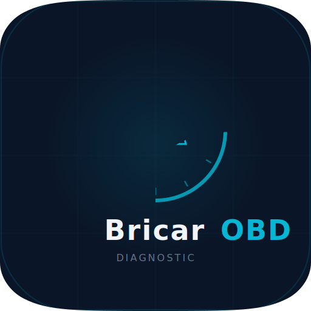

# BricarOBD

<p align="center">
  
</p>

<p align="center">
  <strong>Professional OBD-II diagnostic tool</strong><br/>
  Built with Rust (Tauri 2.x) + React + TypeScript
</p>

<p align="center">
  
  
  
  
  
</p>

---

## Features

### Database
- **3.17M operations** from DDT2000 database (PSA, VAG, BMW, Mercedes, Renault, Toyota, Honda, Hyundai/Kia, Fiat, Ford, Mazda, Subaru, Volvo)
- **8,807 DTC codes** with descriptions + 415 repair tips
- **70 standard OBD-II PIDs** with real-time gauges and charts
- **391 manufacturer-specific DIDs** (PSA 204, Mercedes 30, Hyundai 29, Ford 20, etc.)
- **83 WMI codes** for VIN decoding across 39 manufacturers
- **90 vehicle profiles** with ECU mappings

### Connection
- **9 OBD-II protocols** (CAN 500k/250k 11/29-bit, KWP2000 fast/slow, ISO 9141, J1850 PWM/VPW)
- **4 init strategies** for maximum ELM327 compatibility (genuine, STN, clones v1.5/v2.1)
- **Auto baud rate detection** (9600, 38400, 115200, 230400, 500000)
- **WiFi ELM327** support (TCP transport, auto-scan)
- **Chip detection** (Genuine ELM327, STN1110/2120, Clone identification)
- **Adaptive PID blacklisting** — auto-skips failing PIDs
- **Bus recovery** — auto-reconnect after 5 consecutive timeouts
- **TesterPresent keep-alive** for ECU sleep prevention

### Safety
- **SafetyGuard** with 12 blocked UDS services (default-deny policy)
- Write operations (2E, 2F, 30, 31) only available in Advanced mode
- Always blocked: ECUReset (0x11), SecurityAccess (0x27), Download/Upload (0x34-0x37)
- AT command filtering (ATMA, ATBD, ATBI, ATPP, ATWS)
- Path traversal protection on file exports

### Interface
- **Bilingual FR/EN** with full i18n
- **Glassmorphic automotive theme** with dark mode
- **8 pages**: Connection, Dashboard, Live Data, DTC, ECU Info, Monitors, History, Advanced
- **Developer console** with real-time TX/RX serial logs
- **CSV export** for live data recordings and DTC reports
- **Demo mode** (Peugeot 207) for testing without adapter

## Tech Stack

| Layer | Technology |
|-------|-----------|
| Frontend | React 18 + TypeScript + Vite 5 + Tailwind CSS 3 |
| Backend | Rust + Tauri 2.x |
| Database | SQLite 503 MB (pre-built, 3.17M operations) |
| Serial | serialport crate (USB), TCP (WiFi) |
| Charts | Recharts |
| i18n | react-i18next (FR/EN) |

## Architecture

```
src/                          # React frontend
  pages/                      #   8 tab pages
  components/                 #   Reusable UI (Toast, DevConsole, Charts)
  hooks/                      #   Custom hooks (useToast)
  stores/                     #   State (connection.ts, vehicle.ts)
  lib/                        #   Utils, i18n, devlog

src-tauri/src/                # Rust backend
  obd/                        #   OBD protocol layer
    connection.rs             #     ELM327 + OBDTransport trait
    transport.rs              #     Serial/WiFi/BLE transports
    safety.rs                 #     SafetyGuard (12 blocked services)
    pid.rs                    #     70 PID definitions + decoders
    dtc.rs                    #     DTC parsing (OBD + UDS)
    vin.rs                    #     VIN decoding (83 WMI codes)
    ecu_profiles.rs           #     391 DIDs + ECU maps
    anomaly.rs                #     Real-time anomaly detection
    demo.rs                   #     Demo data generator
  commands/                   #   Tauri IPC handlers
    connection.rs             #     Connect/disconnect/WiFi
    dashboard.rs              #     PID polling + blacklist
    dtc.rs                    #     Multi-method DTC scan
    ecu.rs                    #     ECU discovery + raw commands
    database.rs               #     SQLite queries
    settings.rs               #     CSV export + dev logs
  db/                         #   SQLite database layer
  models/                     #   Shared data types
```

## Getting Started

### Prerequisites

- **Node.js** 20+
- **Rust** 1.80+
- **pnpm** 9+

### macOS additional

```bash
# Xcode command line tools
xcode-select --install
```

### Android additional

```bash
# Android SDK + NDK
# Set ANDROID_HOME, JAVA_HOME
# Install targets:
rustup target add aarch64-linux-android armv7-linux-androideabi x86_64-linux-android i686-linux-android
```

### Development

```bash
# Install dependencies
pnpm install

# Run in dev mode (desktop)
cargo tauri dev

# Run in dev mode (Android)
cargo tauri android dev
```

### Build

```bash
# macOS (.app + .dmg)
cargo tauri build

# Android (.apk)
cargo tauri android build

# Windows (.msi + .exe)
cargo tauri build

# Linux (.deb + .AppImage)
cargo tauri build
```

## Release Builds

### macOS

The macOS build produces a `.app` bundle and `.dmg` installer:

```bash
cargo tauri build
# Output: src-tauri/target/release/bundle/macos/BricarOBD.app
# Output: src-tauri/target/release/bundle/dmg/BricarOBD_2.0.0_aarch64.dmg
```

### Android

```bash
# Initialize Android project (first time only)
cargo tauri android init

# Debug APK
cargo tauri android build --debug

# Release APK (requires signing)
cargo tauri android build
# Output: src-tauri/gen/android/app/build/outputs/apk/
```

> **Note**: The 503 MB SQLite database is bundled with the desktop app. For Android, the database will be downloaded on first launch or a compressed version will be included.

## Screenshots

| Dashboard | Live Data | DTC Codes |
|-----------|-----------|-----------|
| Real-time gauges | PID table + charts | Scan + search + repair tips |

| ECU Info | Advanced | Connection |
|----------|----------|------------|
| Multi-ECU discovery | Raw UDS commands | USB + WiFi + Demo |

## Security

BricarOBD implements a multi-layered safety system:

1. **SafetyGuard** — default-deny policy blocks all write services in normal mode
2. **Advanced mode** — write services (2E, 2F, 30, 31) require explicit user confirmation
3. **Always blocked** — ECUReset, SecurityAccess, Download/Upload, WriteMemory, CommControl
4. **AT command filter** — dangerous AT commands (ATMA, ATBD, ATBI, ATPP, ATWS) always blocked
5. **Path validation** — file exports confined to `BricarOBD_Exports/` directory
6. **WiFi validation** — only private/link-local IPs accepted for adapter connections

## License

See [LICENSE](LICENSE).
